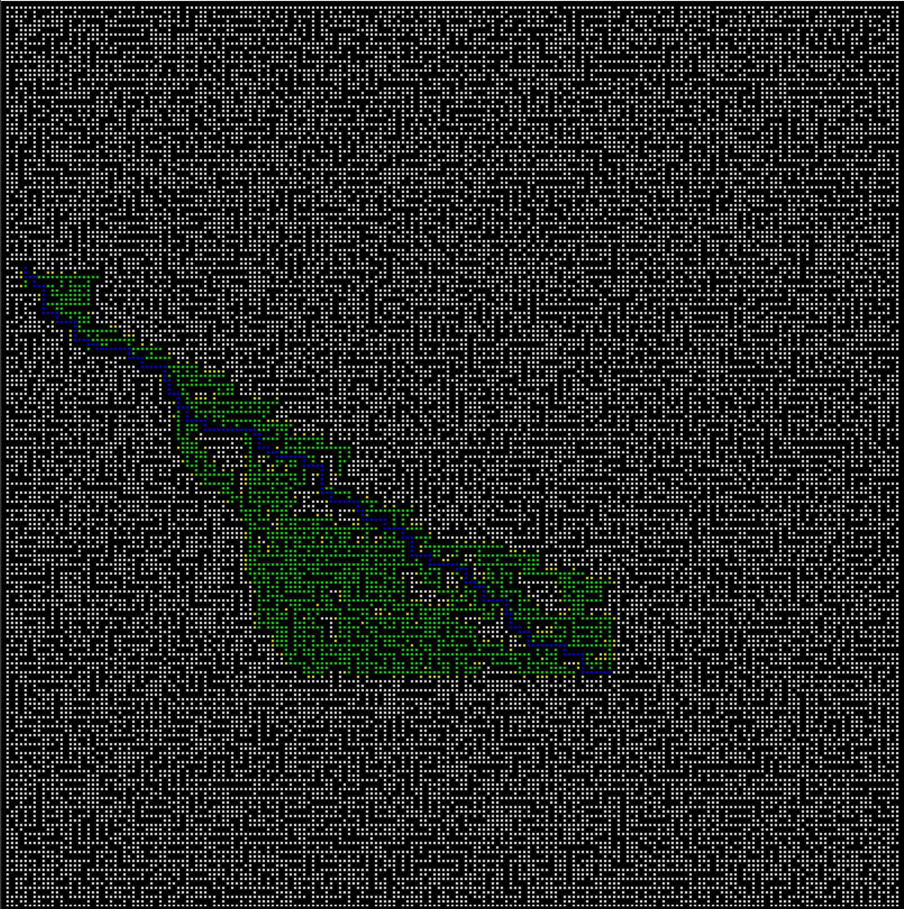
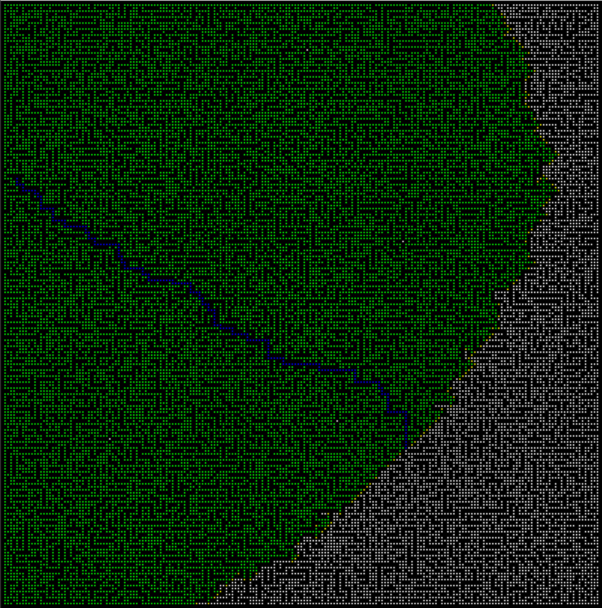
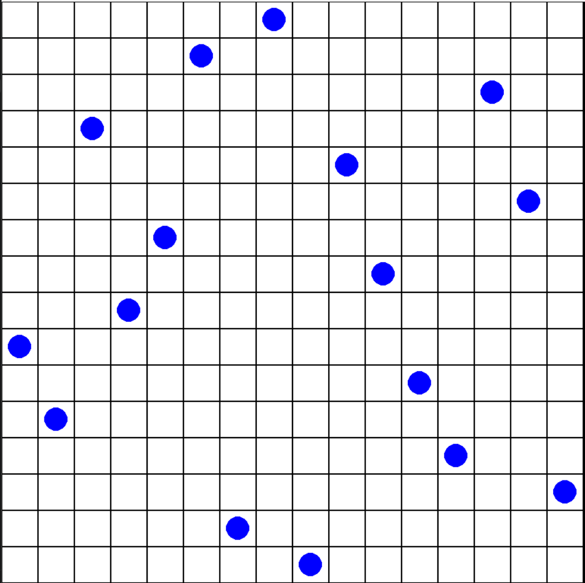
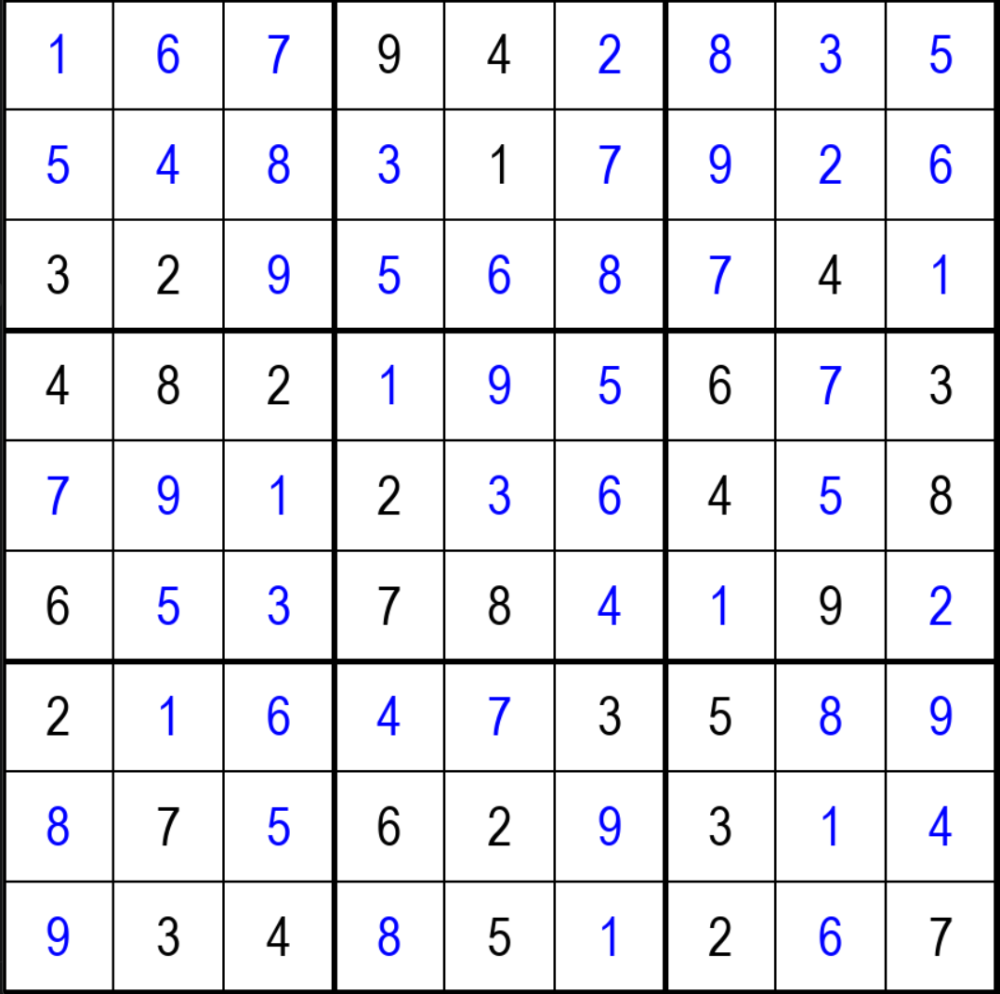

# State Space Search

This repository contains three small Python projects demonstrating state space search and constraint solving algorithms with a Pygame visualization.

## Systematic Search


*A* search visualization*


*Breadth-first search visualization*

The `systematic-search` project finds a path through a maze. The available algorithms are:

- Breadth-first search (`bfs`)
- Depth-first search (`dfs`)
- Random search (`random_search`)
- Greedy search (`greedy_search`)
- A* search (`a_star`)

Run it from the project directory:

```
python main.py ALGORITHM DATASET [-s/--slow_down SECONDS]
```

For example:

```
python main.py bfs 84.txt --slow_down 0.25
```

Maze datasets are stored in `systematic-search/dataset/`. In these files:

- `X` represents a wall
- a space represents a walkable cell
- `start x, y` defines the start position
- `end x, y` defines the goal position

The program prints the start position, goal position, number of expanded cells, and path length after a path is found. The window with visual result remains open until it is manually closed.

## N-Queens


*N-Queens visualization*

The `n-queens` project uses a local search approach. It starts with a random arrangement of queens and repeatedly accepts moves that do not increase the number of threatened queens. The board is randomly restarted periodically if necessary.

Run it from the project directory:

```
python main.py NUMBER_OF_QUEENS MAX_ITERATIONS [-s/--slow_down SECONDS]
```

For example:

```
python main.py 8 100000 -s 0.02
```

The result window remains open until it is manually closed. Since the algorithm starts from a random layout, increasing the maximum number of iterations can improve the chance of finding a solution, especially for larger boards.

## Sudoku


*Sudoku visualization*

The `sudoku` project solves Sudoku using recursive backtracking. It supports square boards such as 4x4, 9x9 and 16x16, provided that the input has the appropriate format.

Run it from the project directory:

```
python main.py DATASET [-s/--slow_down SECONDS]
```

For example:

```
python main.py sudoku3.txt -s 0.05
```

Sudoku datasets are stored in `sudoku/dataset/`. Each row contains numbers separated by spaces. A `0` represents an empty square. The initial values are displayed in black, while values tried by the solver are visualized during the backtracking process.
